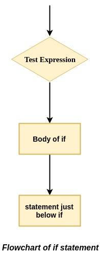
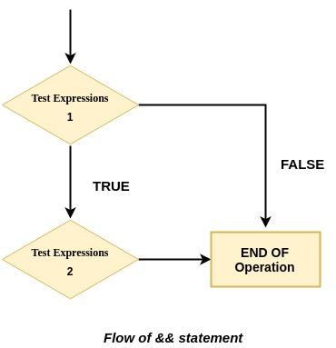
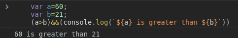

So, today I am going to show you a little `simple tip` of writing if statement without using if statement in a shorter way.. It's an short, simple and coolest version of `IF statement`.

>This can help you clean up your code a little bit, making it easier for the eye.

### Let's see how if statement works?
The `if` statement evaluates the test expression inside the parenthesis `()`.
-   If the test expression is `true`, statements inside the body of  `if`  are executed.
-   If the test expression is `false`, statements inside the body of  `if`  are not executed.



Lets see the code how we write `if statement` while writing code ??

```javascript
	if(condition){
		//block of code to be executed if the condition is true
	}
```
### Now look toward's && operator
The `&&` operator are also known  as `logical AND operator`.  Evaluates operands from left to right. `&&` operator find the first falsy value.

-   for each operand or case, `&&` operator convert it into boolean. if the output is `false`, its stop exectution and return the last operand value.
-   If all operand or case is `true`, return last operand.
```javascript
//if the first operand is true,
//return second operand

alert( 1 && 3 ); // 3

//if the first operand is falsy,
//return first false value,
//and ignore left operands

alert( null && 2 ); // null
```
### So Now See the Shortest way of writing if statement 

Basically, to create own if statement using `&&` operator you just have to follow this structure 
- (condition) && (some instructions) 
- for example:  someVar > someOtherVar && console.log('yeah') This will log 'yeah' if someVar is bigger than someOtherVar.

```javascript
var a=60;
var b=21;
(a>b)&&(console.log(`${a} is greater than ${b}`))
```


In this example we just create two if statements, one with the traditional method and the other with this one, to check if 'someString' is truthy. As we can see, both cases are logged on the console.