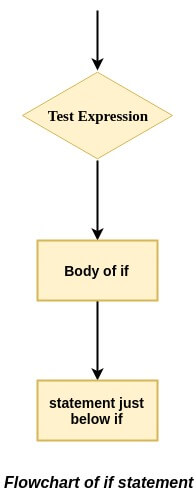
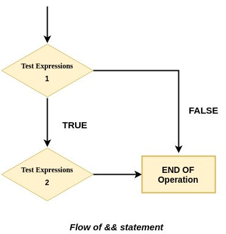
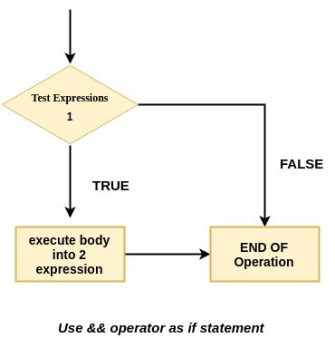
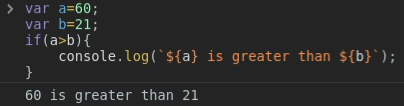
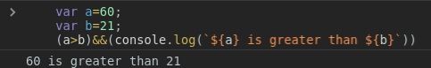
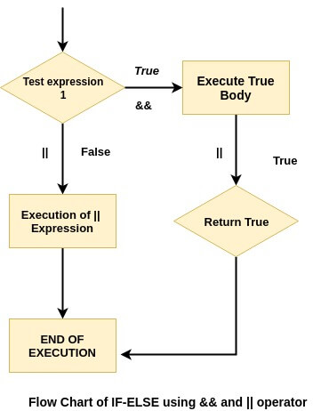
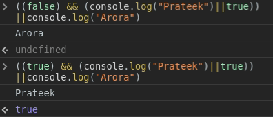

So, today I am going to show you a little `simple tip` of writing an *if statement* without using *if statement* in a shorter way. It's a short, simple and coolest version of `IF statement`.

>This can help you clean up your code a little bit, making it easier to read.

### Let's see how *if statement* works:
An `if statement` evaluates the test expression inside the parenthesis `()`
-   If the test expression is `true`, statements inside the body of  `if`  are executed.
-   If the test expression is `false`, statements inside the body of  `if`  are not executed.



Let's see the code how we write `if statement` while writing code ??

Let's see how the *if statement* code looks like:

```javascript
    if(condition){
        //block of code to be executed if the condition is true
    }
```
### Now let's look at the `&&` operator
The `&&` operator is also known as the `logical AND operator`. It evaluates operands from left to the right and returns the first falsy value.

- For each operand or case, `&&` operator converts the value into boolean. If the output is `false`, it stops the execution and returns the last operand value.
-   If all operands or cases are `true`, it returns the last operand.
```javascript
//If the first operand is true,
//return the second operand

alert( 1 && 3 ); // 3

//if the first operand is falsy,
//return first false value,
//and ignore left operands

alert( null && 2 ); // null
```
### So now let's see the shortest way of writing an if statement 

Basically, to create your own if statement using `&&` operator, you have to follow this structure 



- (condition) && (some instructions) 
- for example:  someVar > someOtherVar && console.log('yeah') This will log 'yeah' if someVar is bigger than someOtherVar.
#### Using *If statement*
```javascript
var a=60;
var b=21;
if(a>b){
	console.log(`${a} is greater than ${b}`);
}
```
**Output**


#### Using *&& opreator*
```javascript
var a=60;
var b=21;
(a>b)&&(console.log(`${a} is greater than ${b}`))
```
**Output**


In this example, we created two if statements. One with the traditional method and the other with the && operator, to check if `(a>b)` is truthy. As we can see, both cases are logged the same console.

> You can also create your own if-else using `&&` and `||` operator



- First, write an if condition like `(true or false)`
- If the condition is truthy, the operator executes the truth body, and the || (or operator) stops the execution as it found a truthy value. **|| returns the first truthy false**.

- Else executes when the condition is falsy when using the || operator. The || operator moves to the next operands to find the first truthy value.

#### Example

#### execute by own and create your own if-else statement 😂
```javascript
((false) && (console.log("execute when condition true")||true))
||console.log("execute when condition false")
```

***
Thank you so much for reading my article on **You may not need if-else statement!** Be sure to follow me on [Twitter](https://twitter.com/prateek_codes) for lots of tweets about tech. Feel free to comment below or tweet me with any questions you may have.